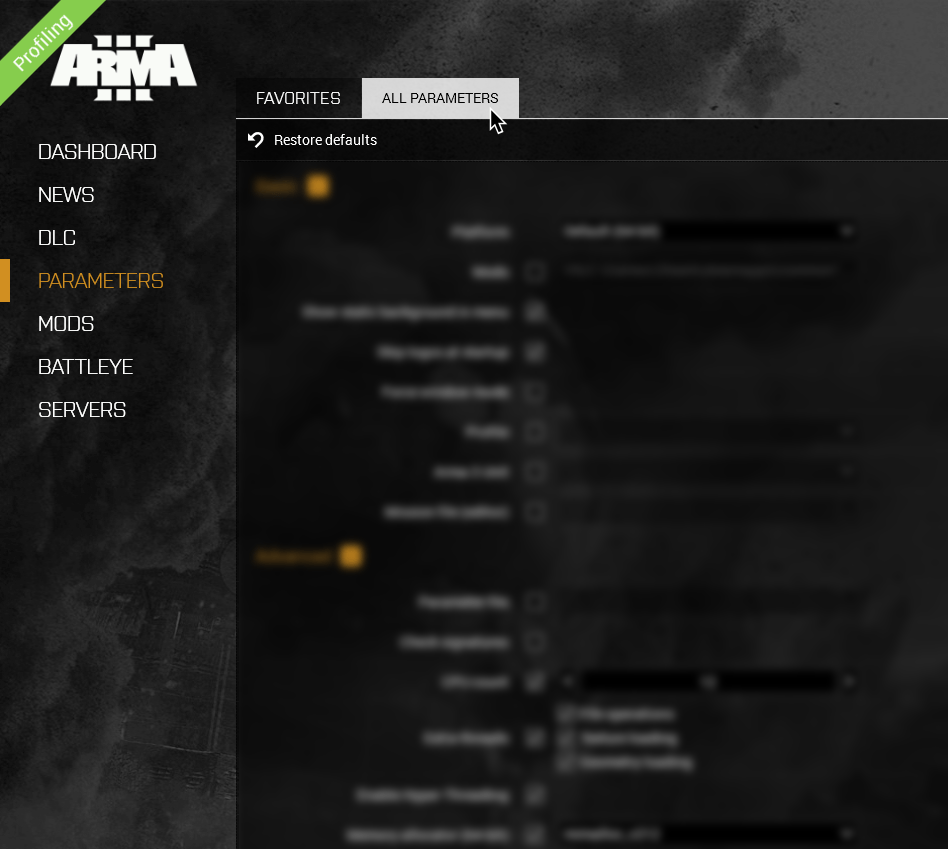
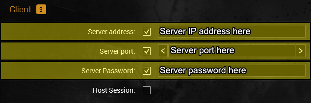

# Pro Tips

### Steam:
We'll be switching to the performance profiling build of ARMA 3 as many report performance improvements.

First, make sure ARMA 3 is closed, along with its launcher.
Find ARMA 3 in your Steam library. Right click on it and then click on "Properties."

On the left side, click on "Betas".
Switch "Beta Participation" to "profiling - Performance Profiling Build." Steam should start updating.

When you're done, click close out the window.

### ARMA 3 Custom Allocator:
We'll be installing a custom allocator to improve performance. **This should only be done if you have at least 16 GBs of RAM!**

First [[click here to download the allocator DLL file]](https://github.com/GoldJohnKing/mimalloc/releases/download/Arma-3-v2.1.2-20230427/mimalloc_v212.dll)

Move the .DLL file into your ARMA 3 folder. The easiest way to get there is to right click on ARMA 3 in your Steam Library, clicking on properties.

Once "Properties" opens, click on  "Installed Files", and then finally "Browse."

Once you are in the ARMA 3 folder, go into on the "Dll" folder.

Move the `mimalloc_v212.dll` file into here.

### ARMA 3 Launcher Parameters:
We'll now be editing the launch parameters in ARMA 3.
**Edits highlighted in yellow are strongly recommended. Edits highlighted in blue will depend on your system.**
For "blue" edits, it's strongly suggested you run a [[benchmark]](https://steamcommunity.com/sharedfiles/filedetails/?id=375092418) to see the options are helping (or harming) performance.

Open ARMA 3 on Steam. It should bring up the launcher.
When the launcher opens up, click on "Parameters." Switch to "All Parameters" to see every parameter too

### Basic
- Show static backgrounds in Menu
		- Loads the main menu faster by loading an image instead of a 3D background.
- Skip logos at startup
		- Speeds up launching by skipping the intro logos.

### Advanced
- CPU Count
	- Certain Ryzens (and possibly Intel) may benefit from setting this to the amount of physical cores (not total threads) the CPU has. **DO NOT ENABLE THIS WITH "Enable Hyper-Threading"!!**
- Extra Threads:
	- File operations
	- Texture Loading
	- Geometry Loading
		- Enabling these will separate these threads out of the main ARMA 3 process, which may improve performance on some systems.
- Enable Hyper-Threading*
	- * Lets a single core run multiple threads. May benefit systems with hyperthreading. **DO NOT ENABLE THIS WITH "CPU count"!!**
- Memory Allocator:
	- Switch this to "mimalloc_v212"
		- Uses an alternative memory allocator, which improves performance. As mentioned above, **this should only be done for systems with at least 16 GBs of RAM**!

### Client
- Server address:*
	- Input the server address here
- Server port:*
	- Input the server port here
- Server Password:*
	- Input the server password here
- * You should only enable these if you mostly play on one server. Fill them out with the server information from Discord.

### Host
- Server port:
	- This will auto enable then "Server port" in client is enabled.

### Author
- No Pause
	- Keeps the game running when you tab out. Helps with stability as the game pausing and unpausing can lead to crashes.
- No Pause Audio
	- Keeps the game audio running when you tab out. Helps with awareness and doesn't pop speakers/headphones when switching in and out of ARMA 3.

### Compatibility
- **DO NOT TOUCH ANYTHING IN HERE!**

## In-Game Settings
The next settings will be done in-game. You should probably do these while logged in and playing on a mission/server or in the VR rooms.

### ARMA 3 Video Settings:
We'll be switching to the "Fullscreen Window" (aka Borderless Window) display mode since the game sometimes crashes when tabbing in and out while in Fullscreen.

Press ESC. Click on "Configure" then click on "Video."

Click on "Display" then click on "Display Mode" and switch it to "Fullscreen Window"

### ARMA 3 Control Settings:
Press ESC. Click on "Configure" then click on "Controls."

#### Unmapping "Last Help":
We're disabling "Last Hint" as it tends to clash with the medical menus.

In the "Common" controls category, scroll down until you see "Last Hint" then click on it.

Click on the "H" then click on "Delete", then click "OK."

#### Unmapping "Throw":
We're disabling "Throw" as it usually gets bumped by accident and causes friendly fire. We'll be using ACE's Throw function instead, which is already bound to Shift+G.

At the top in controls, you should see "Show: Common."
Click on "Common" and switch it to "Weapons."

Scroll down until you see "Throw" then click on it.

Click on "G", click "Delete", then click "OK.""

You can alternatively bind it to "Gx2" by double tapping G while "G" is highlighted.

### ARMA 3 Control Settings/Configure Addons:
We'll now focus on setting up and editing key binds for mods. At the bottom of the "Controls" settings, click on "Configure Addons."

You'll be switching which addon's binds you're configuring by clicking on "Addon: (Name of addon)" then switching it to the addon you want.

#### Enhanced Movement Rework:
We'll be editing Enhanced Movement Rework key binds. These are for climbing and safely dismounting buildings and other objects.

You should bind "All-in-one action" to Shift+Space and "Assist" to Alt+V, which is default. You can alternatively bind these to your preference.

#### TFAR
We'll be removing all of the cycling hotkeys in TFAR as they conflict with another mod (CH View Distance) which is used more frequently.

Scroll down until you see "Cycle Next SR Radios" and click on it.

Delete all of the keybinds from "Cycle Next SR Radios" to "Cycle Previous LR Channel." You can quickly go from one to another by clicking "Next" above the keybind.

#### WindowBreaker:
We'll be assigning a hotkey for WindowBreaker, which helps you, surprise, breaks windows.

You should bind "Smash" to "Shift+T."

