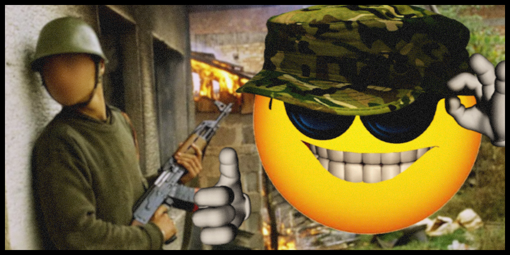

# Chernarus Liberation: 1990s Civil War

    

### About:
Before the turn of the millennium, Chernarus is plunged into a civil war caused by a violent secession. You are within a group of Chernarussians on a daring mission to liberate key enemy sectors scattered across the war-torn landscape of Chernarus and her islands within the Green Sea region. Expect the unexpected as you have to fight against people you once greeted as your neighbors. Good luck!

### Requirements:
- [[ARMA] 3 (Size: 40.61 GBs)](https://store.steampowered.com/app/107410/Arma_3/)
- A microphone
- [[Teamspeak 3 (TS3) v3.6.1]](https://files.teamspeak-services.com/releases/client/3.6.1/TeamSpeak3-Client-win64-3.6.1.exe)
- [[Join Moistbois’ Discord for server passwords and IPs.]](https://discord.com/invite/FeyqxXA)
- [[Task Force Arrowhead Radio (TS3 Plugin)]](https://cdn.discordapp.com/attachments/687630994123390986/1122243967614988308/task_force_radio.ts3_plugin)
- [[Chernarus Liberation 1990s] (Size: 40 GBs)](https://github.com/moistbois/info/releases/tag/modlists)
    - [[Alternative Steam Collection download]](https://steamcommunity.com/sharedfiles/filedetails/?id=3232700442)

### Rules:
- Don’t be a dick.
- Don’t relog to skip unconsciousness. This is not a KOTH server.
- This is a cooperative server. Teamwork is essential.
- Keep game related chatter in-game. (i.e. don’t use text chat, Twitch, Discord, etc.)
- Do not waste assets (vehicles, static weapons, etc.)
- No cheating (includes exploits and metagaming.)

### [[Modlist]](https://github.com/moistbois/info/releases/tag/modlists):
- ace
- Advanced Sling Loading
- Advanced Towing
- Automatic Warning Suppressor
- Better Inventory
- CBA_A3
- CH Bright Nights
- CH View Distance
- Cold War Moustaches
- CUP Terrains - Core
- DHI Uniforms and Equipment
- Discord Rich Presence
- DUI - Squad Radar
- Enhanced Movement
- Enhanced Movement Rework
- Explosive Fuel Containers
- Extra RHS Uniform Re-textures
- Green Sea Terrain
- Gruppe Adler Trenches
- Helicopter Turbulence
- Hide Among The Grass - HATG
- Immerse
- Immersion Cigs
- Improved ACE Arsenal Category
- Insects and Bugs Mod
- Interiors for CUP
- JSRS SOUNDMOD
- JSRS SOUNDMOD - RHS  AFRF Mod Pack Sound Support
- JSRS SOUNDMOD - RHS GREF Mod Pack Sound Support
- JSRS SOUNDMOD - RHS SAF Mod Pack Support
- JSRS SOUNDMOD - RHS USAF Mod Pack Sound Support
- KLPQ Music Radio
- Ladder Tweak
- LAMBS_Danger.fsm (DEV)
- LAMBS_RPG_RHS
- LAMBS_Suppression
- LAMBS_Turrets
- Moistbois Factions - Chernarus 1990s
- Moistbois Radio - Green Sea 1990s
- NIArms AK Rifles
- NIArms AR15 Rifles
- NIArms Core
- NIArms Core - RHS Compatibility
- NIArms G3 Rifles
- No More Aircraft Bouncing
- Project OPFOR
- RDS Civilian Pack
- RHSAFRF
- RHSGREF
- RHSSAF
- RHSUSAF
- RR Immersive Maps by LAxemann
- SSD Death Screams 2.1
- Task Force Arrowhead Radio (BETA!!!)
- TFAR Animations
- TFAR compat - DHI
- Walkers A2 Vehicles
- WBK Simple Blood
- Window Breaker
- Zeus Enhanced
- Zeus Enhanced - ACE3 Compatibility
- Death and Hit reactions

### Additional Mods:
- [[A3 Characters 4K]](https://steamcommunity.com/sharedfiles/filedetails/?id=2965541384) - Uses more GPU resources
- [[Aaren's Blast Effects]](https://steamcommunity.com/sharedfiles/filedetails/?id=2424322922) - Uses more GPU resources
- [[Blastcore Edited (standalone version)]](https://steamcommunity.com/sharedfiles/filedetails/?id=767380317) - Uses considerably more GPU resources
- [[Blastcore Murr Edition]](https://steamcommunity.com/sharedfiles/filedetails/?id=2257686620) - Uses considerably more GPU resources
- [[Bullet Casings v1.1 (Local Mod)]](https://discord.com/channels/435753869293649920/712634879073845349/1176893790024372346) - Uses more GPU and CPU resources
- [[Enhanced Soundscape]](https://steamcommunity.com/sharedfiles/filedetails/?id=825179978) - Uses more CPU resources
- [[Enhanced Soundscape Plus]](https://steamcommunity.com/sharedfiles/filedetails/?id=2938312887) - Uses more CPU resources
- [[Align]](https://steamcommunity.com/sharedfiles/filedetails/?id=903134884) - Makes shooting more immersive and slightly more difficult
- [[Auto Weapon Lower]](https://steamcommunity.com/sharedfiles/filedetails/?id=1612623122) - Lowers the weapon automatically when not in combat
- [[MapTools Remastered]](https://steamcommunity.com/sharedfiles/filedetails/?id=1612623122) - Changes the map tools' aesthetic.
- [[Salmon Quick Release Buckle]](https://steamcommunity.com/sharedfiles/filedetails/?id=1528867402) - Allows you to quickly drop your gear.

### Soundtrack: 
[[Pastebin]](https://pastebin.com/P4Q4WS31)

### Credits:
- [[GreuhZbug (original Liberation developer)]](https://github.com/GreuhZbug/greuh_liberation.Altis)
- [[Killah Potatoes (developers of KP Liberation)]](https://github.com/KillahPotatoes/KP-Liberation)
- [[Apricot-ale (fork maintainer/developer for KP Liberation APR)]](https://github.com/Apricot-ale/KP-Liberation-APR)
- [[Doxus (Mission design and programming)]](https://github.com/moistbois/Moist-Liberation-APR)
- [[Carl Mylo (Mission design and programming)]](https://www.twitch.tv/carlmylo)
- [[TiredSloth (Balancing)]](https://github.com/moistbois/Moist-Liberation-APR)
- [[Pantrh (Mission design)]](https://www.twitch.tv/pantrh)
