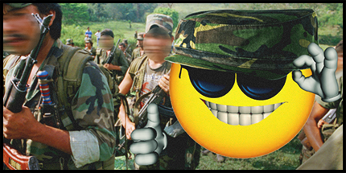

# Lingor Liberation: Glowing Contras

    

### About:
The year is 1987. The tropical Latin American paradise of Lingor is ripe for a bit of political meddling. The CIA is putting resources and support behind your little "contra" group to prevent the local dissidents from promoting their ideology in your country. You'll have plenty of leftover gear from the failed Vietnam War to aid you in this mission. Let's hope it goes well this time around. Just don't mention that the CIA is helping you because they'll deny everything. Good luck, vaya con dios, and don't forget your mirror and sun tan.

### Requirements:
- [[ARMA] 3 (Size: 40.61 GBs)](https://store.steampowered.com/app/107410/Arma_3/)
- S.O.G. Prairie Fire (Size: 35.7 GBs)
	- [[Paid version]](https://store.steampowered.com/app/1227700/Arma_3_Creator_DLC_SOG_Prairie_Fire/)
	- [[Trial version]](https://steamcommunity.com/sharedfiles/filedetails/?id=2477276806)
- A microphone
- [[Teamspeak 3 (TS3) v3.6.1]](https://files.teamspeak-services.com/releases/client/3.6.1/TeamSpeak3-Client-win64-3.6.1.exe)
- [[Join Pantrh’s Discord for server info]](https://discord.com/invite/FeyqxXA)
- [[Task Force Arrowhead Radio (TS3 Plugin)]](https://cdn.discordapp.com/attachments/687630994123390986/1122243967614988308/task_force_radio.ts3_plugin)
- [[Lingor Liberation 1987 Mods v1.3.0] (Size: 41.3 GBs)](https://github.com/moistbois/Moist-Liberation-APR/releases/download/modlists/Arma.3.Preset.LingorLiberation1987_3.html)

### Rules:
- Don’t be a dick.
- Don’t relog to skip unconsciousness. This is not a KOTH server.
- This is a cooperative server. Teamwork is essential.
- Keep game related chatter in-game. (i.e. don’t use text chat, Twitch, Discord, etc.)
- Do not waste assets (vehicles, static weapons, etc.)
- No cheating (includes exploits and metagaming.)

### Modlist:
- ace
- Automatic Warning Suppressor
- Better Inventory
- Blastcore Edited (standalone version)
- cb_blood
- CBA_A3
- CH View Distance
- CUP Terrains - Core
- Colombian Armed Forces RHS
- DHI Uniforms and Equipment
- DUI - Squad Radar
- Discord Rich Presence
- Enhanced Movement
- Enhanced Movement Rework
- Extra RHS Uniform Re-textures
- GSTAVOs  M16A2
- GX - Objects
- Global Mobilization - Demo Vehicle
- Gruppe Adler Trenches
- Immerse
- Immersion Cigs
- Improved ACE Arsenal Category
- Interiors for CUP
- JSRS SOUNDMOD
- JSRS SOUNDMOD - RHS  AFRF Mod Pack Sound Support
- JSRS SOUNDMOD - RHS GREF Mod Pack Sound Support
- JSRS SOUNDMOD - RHS SAF Mod Pack Support
- JSRS SOUNDMOD - RHS USAF Mod Pack Sound Support
- KLPQ Music Radio
- Lingor/Dingor Island
- Moistbois Factions - Lingor 1980s
- Moistbois Radio - Lingor 1980s
- NIArms Core
- NIArms Core - RHS Compatibility
- NIArms FAL Rifles
- NIArms G3 Rifles
- NIArms M1903 Springfield Rifles
- Project OPFOR
- RDS Civilian Pack
- RHSAFRF
- RHSGREF
- RHSSAF
- RHSUSAF
- S.O.G. Melee CBA Keybind
- S.O.G. Prairie Fire
- SSD Death Screams 2.1
- Spanish Voice-Overs and Radio Protocol
- TAC VESTS
- Task Force Arrowhead Radio (BETA!!!)
- Walkers A2 Vehicles
- Window Breaker
- Zeus Enhanced
- Zeus Enhanced - ACE3 Compatibility

### Additional Mods:
- [[A3 Characters 4K]](https://steamcommunity.com/sharedfiles/filedetails/?id=2965541384) - Uses more GPU resources
- [[Aaren's Blast Effects]](https://steamcommunity.com/sharedfiles/filedetails/?id=2424322922) - Uses more GPU resources
- [[Blastcore Murr Edition]](https://steamcommunity.com/sharedfiles/filedetails/?id=2257686620) - Uses considerably more GPU resources
- [[Bullet Casings v1.1 (Local Mod)]](https://discord.com/channels/435753869293649920/712634879073845349/1176893790024372346) - Uses more GPU and CPU resources
- [[Enhanced Soundscape]](https://steamcommunity.com/sharedfiles/filedetails/?id=825179978) - Uses more CPU resources
- [[Enhanced Soundscape Plus]](https://steamcommunity.com/sharedfiles/filedetails/?id=2938312887) - Uses more CPU resources
- [[Salmon Quick Release Buckle]](https://steamcommunity.com/sharedfiles/filedetails/?id=1528867402)

### Soundtrack: 
[[Spotify]](https://open.spotify.com/playlist/17qI9iF4z3H0jpAHQbeb5a) [[YouTube]](https://youtube.com/playlist?list=PLAcQFoGuH-azw9XQoB1m6NeAstF0yvtWx&si=8TNUAxP8eTcaPSAE) [[Pastebin]](https://pastebin.com/2XucxLJ5)
- ABBA - Gimme! Gimme! Gimme! (A Man After Midnight)
- Accept - Lady Lou
- Adolfo Echeverria Y Su Orquesta - Amanciendo
- Armando Hernandez Y Su Conjunto - La Zenaida
- Arthur Verocai - Presente Grego
- Azymuth  - Melô Dos Dois Bicudos
- Azymuth - Faça de Conta
- Billy Idol - Rebel Yell
- Black Sabbath - Sweet Leaf
- Bon Jovi - Livin' On A Prayer
- Caifanes - Viento
- Celia Cruz - A Papa
- Celina y Reutilio - Alborada Guajira
- Charly García - No Bombardeen Buenos Aires
- Charly García - Nos Siguen Pegando Abajo
- Corey Hart - Sunglasses At Night
- Cortijo y Kako y Sus Tambores - Qué Le Pasó
- Danza Invisible - Sin aliento
- Daryl Hall & John Oates - Out Of Touch
- David Bowie - Rebel Rebel
- Def Leppard - Photograph
- Depeche Mode - Everything Counts
- DIO - Holy Diver
- Diomedes Diaz - Recuerdos de la Montaña
- Dire Straits - Walk Of Life
- Doogy Degli Armonium - Wanted
- Duncan Dhu - En algún lugar
- Duran Duran - Rio
- Eagles - Life in the Fast Lane
- El Combo de los Galleros - Soledad
- El Gran Combo - Un Verano En Nueva York
- Elia y Elizabeth - Todo en la Vida
- Enanitos Verdes - Guitarras Blancas
- Enanitos Verdes - La Muralla Verde
- Eric Clapton - Cocaine
- Fito Olivares Y Su Grupo - Juana La Cubana
- Fleetwood Mac - The Chain
- Focus - Hocus Pocus
- Gabriel Romero Y Su Orquesta - La Piragua
- Gabriel Romero Y Su Orquesta - La Subienda
- Gary Low - I Want You (Edit)
- Gilberto Gil - Palco
- Git - Viento Loco
- Grupo Los Yoyi - El Fino
- Grupo Pegasso - La Despedida
- Guns N' Roses - Paradise City
- Harold Faltermeyer - Axel F
- Heaven 17 - (We Don't Need This) Fascist Groove Thang
- Héctor Lavoe - El Todopoderoso
- Hermanos - Cantaré Cantarás
- Héroes del Silencio - Mar adentro
- Hombres G - Devuélveme a mi chica
- Hombres G - El ataque de las chicas cocodrilo
- Human League - Don't You Want Me
- Irakere - Bacalao Con Pan
- Irakere - Gira Gira
- Iron Maiden - The Trooper
- Jeanette - ¿Porqué te vas?
- Joe Arroyo - Rebelión
- Joy Division - Transmission
- Judas Priest - Breaking the Law
- Kenny y los Eléctricos - No Huyas de Mi
- La Sonora Del Caribe - Noche de Estrellas
- La Sonora Dinamita - Cumbia Soleada
- La Sonora Dinamita - Se Me Perdio la Cadenita
- La Sonora Santanera - El Botones
- La Unión - Lobo-hombre en París
- Las Grecas - Orgullo
- Las Grecas - Te Estoy Amando Locamente
- Laura Branigan - Self Control
- Lito Barrientos Y Su Orquesta - Caracol
- Los Angeles Azules - Cumbia Enamorada
- Los Barón De Apodaca - Hoja Seca
- Los Corraleros De Majagual - Cumbia Campesina
- Los Corraleros De Majagual - Llora Acordeon
- Los Cumbiamberos de Pacheco - Santo Domingo
- Los Electrodomesticos - El Frio Misterio
- Los Gavilanes De La Costa - Los Gavilanes
- Los Guacharacos - Esperma y Ron
- Los Guaracheros de Oriente - El Tira Y Jala
- Los Immortales - La Pollera Colorá
- Los Plebeyos - Que Calor, Que Calor
- Los Prisioneros - Nunca Quedas Mal Con Nadie
- Los Prisioneros - Quieren Dinero
- Los Reyes '73 - Adeoy
- Los Satelies - Ocaso Marino
- Los Tigres del Norte - La Puerta Negra
- Los Warahuaco - El Pescador de Baru
- Los Yetis - Llegaron los Peluqueros
- Los Yorks - Solo Pido Amor
- Luis Miguel - Ahora Te Puedes Marchar
- Marcos Valle - Estrelar
- Marcos Valle - Paz E Futebol
- Men At Work - Be Good Johnny
- Men Without Hats - The Safety Dance
- Menudo - Subete a Mi Moto
- Michael Jackson - Beat It
- Miguel Mateos & Zas - Cuando Seas Grande
- Miguel Mateos & Zas - Donde Arde la Ciudad
- Ministry - Over The Shoulder
- Modern Talking - Cheri Cheri Lady
- Montería Swing - La Samaria
- Mötley Crüe - Live Wire
- Mr. Mister - Broken Wings
- Musical Youth - Pass The Dutchie
- Nacha Pop - Persiguiendo Sombras
- New Order - Blue Monday (12' Version)
- Octavio Mesa y Su Conjunto - La Pelea Con el Diablo
- Orquesta Ritmo de Sabanas - Porro Bonito
- Patrick Cowley - Do You Wanna Funk (feat. Sylvester)
- Patxi Andion - Si Yo Fuera Mujer
- Paul Engemann - Scarface (Push it to the Limit)
- Pedro Laza Y Sus Pelayeros - Cumbia del Monte
- Pet Shop Boys - West End Girls
- Pink Floyd - Money (Edit)
- Propaganda - p_Machinery
- Q Lazzarus - Goodbye Horses
- Radio Futura - A Cara o Cruz
- Radio Futura - Escuela de Calor
- Ramones - Havana Affair
- Ratt - Round and Round
- Red Rider - Lunatic Fringe
- Ric Ocasek - Keep On Laughin'
- Rodolfo Aicardi - La Colegiala
- Rodolfo Y Su Tipica - Tabaco y Ron
- Santa Esmeralda - Don't Let Me Be Misunderstood
- Santana - Oye Como Va
- Santana - Tales of Kilimanjaro
- Scorpions - Still Loving You
- Sintesis - Con la Luz de la Mañana
- Soda Stereo - El Cuerpo Del Delito
- Soda Stereo - Persiana Americana
- Soda Stereo - Sin Sobresaltos
- Sonora Dinamita - Ritmo De Tambo
- Styx - Renegade
- Suicidal Tendencies - I Shot the Devil
- Talking Heads - Life During Wartime
- Ted Nugent - Stranglehold
- The Alan Parsons Project - I Wouldn't Want To Be Like You
- The Cars - Heartbeat City
- The Cure - A Forest
- The Latin Brothers - Las Caleсas Son Como Las Flores
- The Police - Message In A Bottle
- Thompson Twins - Love On Your Side
- Trans-X - Living On Video
- Van Halen - Jump
- Veni Vidi Vici - Viviendo de Noche
- Vicente Fernández - El Rey
- Village People - Can't Stop the Music
- Virus - Pronta Entrega
- Vivien Vee - Remember
- Xavier Cugat & His Orchestra - Cuban Mambo
- Yaz - Situation (US 12" Mix)

### Credits:
- [[GreuhZbug (original Liberation developer)]](https://github.com/GreuhZbug/greuh_liberation.Altis)
- [[Killah Potatoes (developers of KP Liberation)]](https://github.com/KillahPotatoes/KP-Liberation)
- [[Apricot-ale (fork maintainer/developer for KP Liberation APR)]](https://github.com/Apricot-ale/KP-Liberation-APR)
- [[Doxus (Mission design and programming)]](https://github.com/moistbois/Moist-Liberation-APR)
- [[Carl Mylo (Mission design and programming)]](https://www.twitch.tv/carlmylo)
- [[Pantrh (Mission design)]](https://www.twitch.tv/pantrh)
